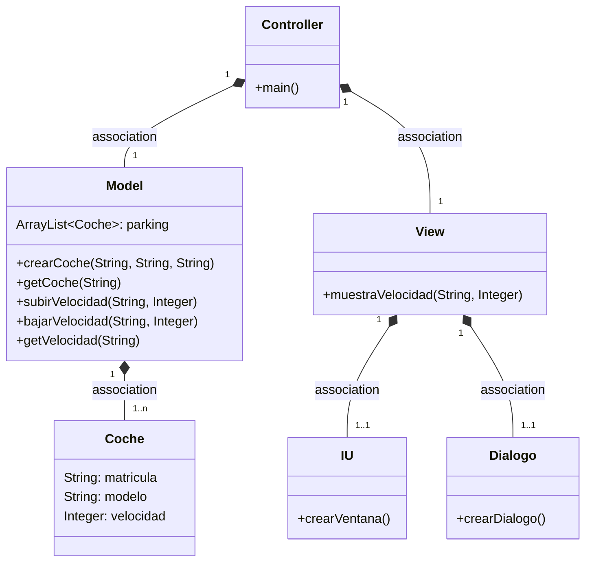
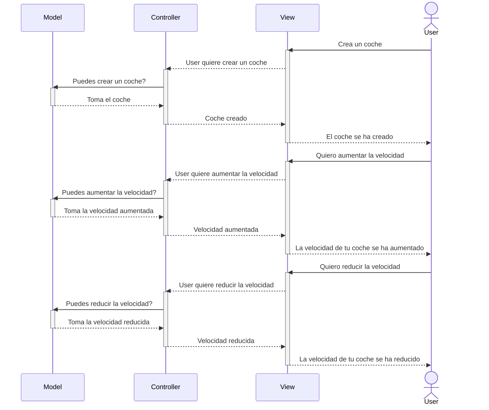
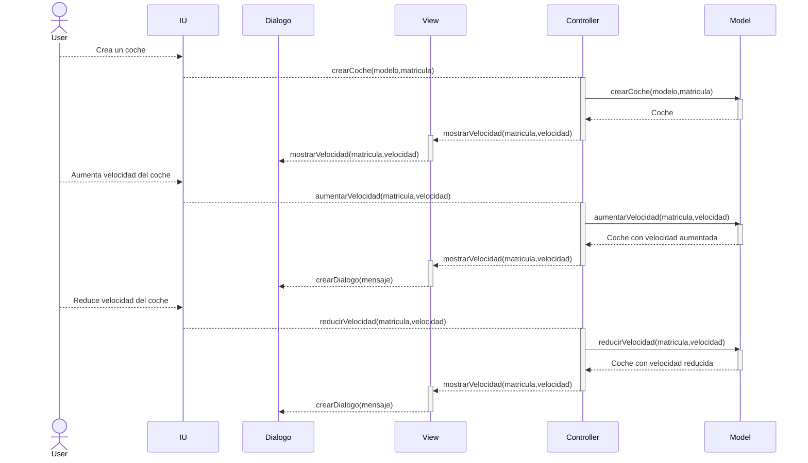

# Arquitectura MVC

Aplicación que trabaja con objetos coches, los crea, modifica la velocidad y la muestra

---
## Diagrama de clases:

---

## Diagrama de Secuencia

Ejemplo básico del procedimiento

Mismo diagrama con los nombres de los métodos

