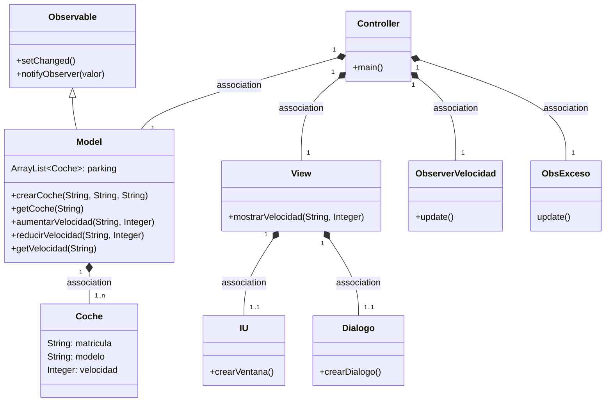
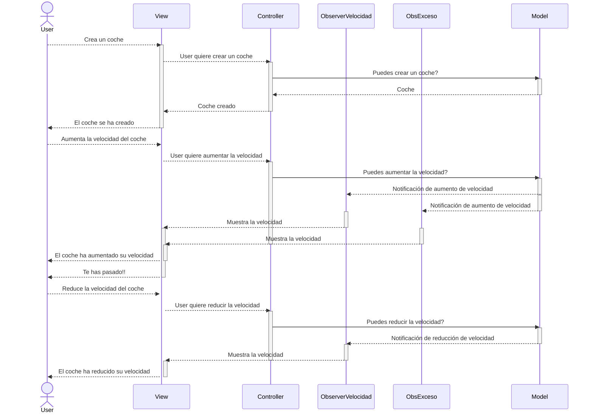
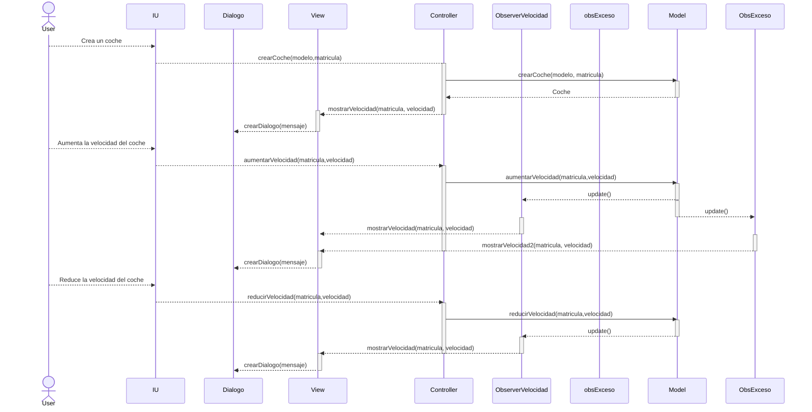

# Arquitectura MVC con Patrón Observer

En esta rama utilizaremos el patrón Observer

Los cambios de la velocidad que se hagan en el model serán observados por el Controller.

Para notificar a los observadores hacemos dos pasos:
- Actualizamos el estado de 'algo a cambiado' con `setChange()`
- Notificamos a los observadores `notifyObservers(valor)`

De esta manera se dispara en todos los observadores el método `update()`

---
## Diagrama de clases:



---

## Diagrama de Secuencia
### Evento en el View
El observer está para controlar el cambio de velocidad


El mismo diagrama con los nombres de los métodos


Si sumamos otro observador, entonces el update() será en paralelo (par)
a todos los Observadores.
```mermaid
sequenceDiagram
participant View
participant Controller
participant ObserverVelocidad
participant ObserverOtro
participant Model

    Controller->>Model: cambiarVelocidad()
    activate Model
    par notificacion
        Model->>ObserverVelocidad: update()
    and notificacion
        Model->>ObserverOtro: update()
        end
    deactivate Model
    activate ObserverVelocidad
    activate ObserverOtro
    ObserverVelocidad->>+View: mostrarVelocidad
    deactivate ObserverVelocidad
    ObserverOtro->>-ObserverOtro: sout
    activate View
    View->>-View: sout
    deactivate View
 ```    
## Pasos para la configuración

1. Model
   * Extender `Observable` en `Model`
   * En el método en donde ocurra el cambio:
     * setChenged()
     * notifyObserver(valor)
2. Crear una clase que sea el observador, que implementa la interface `Observer`
    * definir el método `update()`
3. Controller
    * Instanciar el observer, definido en el punto anterior
    * Añadir este observer al observable con `addObserver()`
